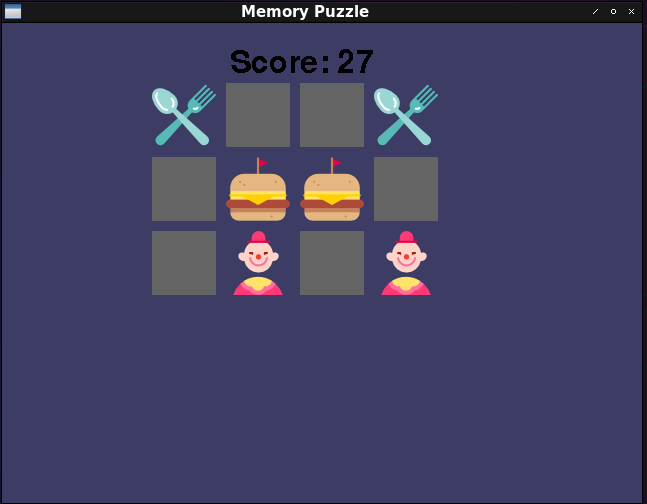
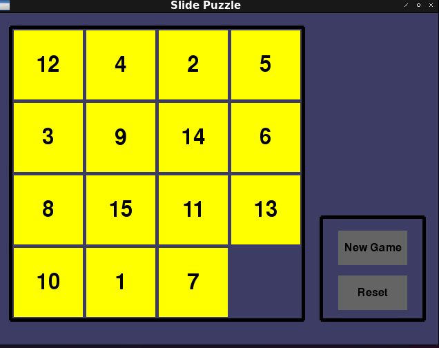
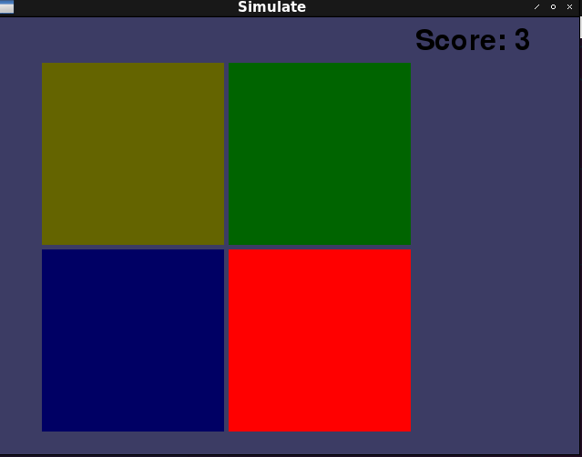
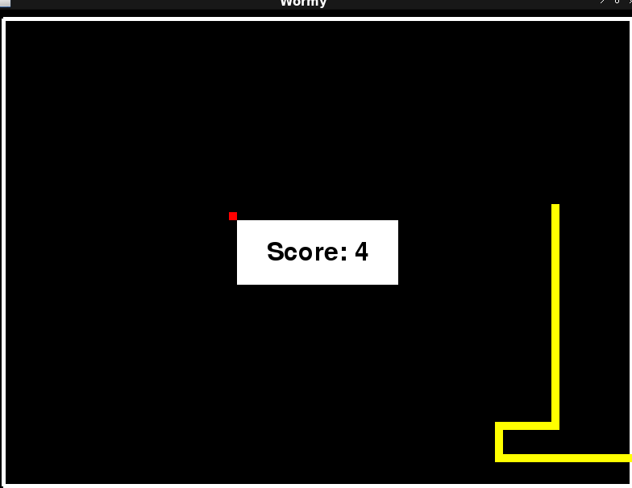
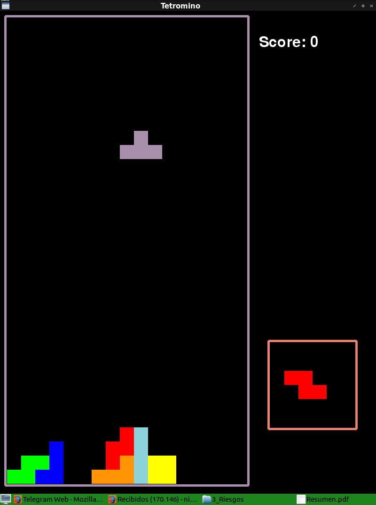

# Python Gamming tutorials
Following tutorials from <a href=https://inventwithpython.com/makinggames.pdf>this guide</a> and <a href=http://thepythongamebook.com/en:pygame:start>this guide</a>.

- [x] <a href="https://github.com/videlanicolas/pythongame/tree/master/basics">Basics</a> (blank screen, draw primitives, animate primitives, display fonts, sounds, music)
- [x] <a href="https://github.com/videlanicolas/pythongame/tree/master/MemoryPuzzle">Memory Puzzle</a>
- [x] <a href="https://github.com/videlanicolas/pythongame/tree/master/SlidePuzzle">Slide Puzzle</a>
- [x] <a href="https://github.com/videlanicolas/pythongame/tree/master/Simulate">Simulate</a>
- [x] <a href="https://github.com/videlanicolas/pythongame/tree/master/Wormy">Wormy</a>
- [x] <a href="https://github.com/videlanicolas/pythongame/tree/master/Tetromino">Tetromino</a>
- [ ] Squirrel eat squirrel
- [ ] Star pusher
- [ ] Flippy
- [ ] Ink spill
- [ ] Connect four
- [ ] Gemgem

### How to play?

Clone this repo (get all games):

```
sudo apt-get install -y git
git clone https://github.com/videlanicolas/pythongame.git
```

Or download the game you want to play:

```
sudo apt-get install -y subversion
svn export https://github.com/videlanicolas/pythongame/trunk/<Game's Folder>
cd <Game's Folder>
source venv/bin/activate
pip install -r requirements.txt
./<game's name>.py
```

Example:

```
sudo apt-get install -y subversion
svn export https://github.com/videlanicolas/pythongame/trunk/Tetromino
cd Tetromino
source venv/bin/activate
pip install -r requirements.txt
./tetromino.py
```

Have fun!

## Game screenshots

### Memory Puzzle


### Slide Puzzle


### Simulate (a.k.a. Simon Says)


### Wormy (a.k.a. Snake)


### Tetromino (a.k.a. Tetris)
